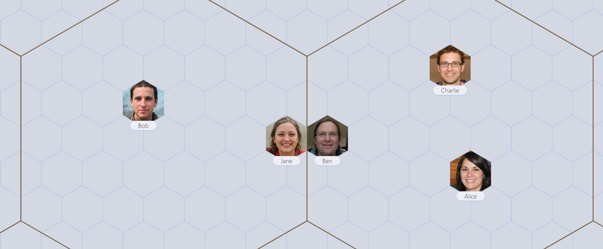

# OpenAGI

DIY AI landscape growing safely in the privacy of your own computer

## Assemble your crew

## Intuitive relationships

Understand implied relationships from visual borders on different zoom levels.

Border can imply storage ➡️ processing ➡️ output, or other relationships that make sense in the context.

## Under the hood

If you wish to have a closer look at the threads of the server, you can use the command `pm2 monit` to see what individual job handler worker threads are up to.
